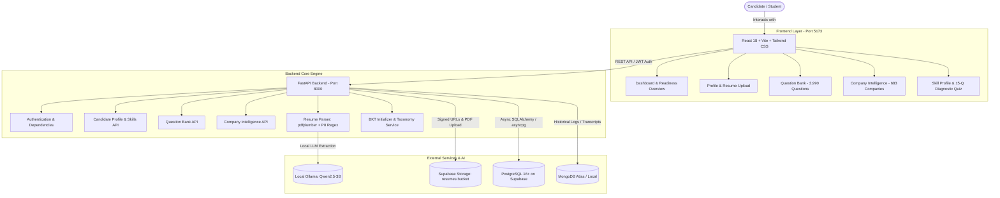

# Smart Prep (PrepAI)

> **Personalized Placement Preparation and Realistic Interview Simulation System**  
> An intelligent, data-driven platform that bridges the gap between college curricula and real-world placement assessments through company-specific hiring intelligence, adaptive evaluation (Bayesian Knowledge Tracing), realistic Online Assessment (OA) sandboxing, and hybrid AI mock interviews.

[](https://fastapi.tiangolo.com)
[](https://reactjs.org/)
[](https://www.postgresql.org/)
[](https://supabase.com/)
[](https://tailwindcss.com/)
[](https://ollama.com/)
[](https://opensource.org/licenses/ISC)

---

## 📑 Table of Contents

- [Overview](#-overview)
- [System Architecture](#-system-architecture)
- [Module Breakdown & Implementation Status](#-module-breakdown--implementation-status)
- [Key Features](#-key-features)
  - [1. Candidate Profile & Diagnostic Calibration](#1-candidate-profile--diagnostic-calibration-module-1)
  - [2. Company Intelligence & Question Bank (3,990+ Questions, 683 Companies)](#2-company-intelligence--question-bank-modules-2--3)
  - [3. Interactive Skill Taxonomy & BKT Calibration](#3-interactive-skill-taxonomy--bkt-calibration)
- [Tech Stack](#-tech-stack)
- [Project Directory Layout](#-project-directory-layout)
- [Getting Started](#-getting-started)
  - [Prerequisites](#1-prerequisites)
  - [Installation](#2-installation)
  - [Environment Configuration (`.env`)](#3-environment-configuration)
  - [Data Migration & Seeding](#4-data-migration--seeding)
  - [Running the Application (Single Command)](#5-running-the-application-single-command)
- [Testing & Verification](#-testing--verification)
- [API Documentation](#-api-documentation)
- [Troubleshooting & Gotchas](#-troubleshooting--gotchas)
- [Roadmap & Implementation Blueprint](#-roadmap--implementation-blueprint)

---

## 🎯 Overview

Campus placements require students to clear multiple rigorous rounds: **Online Assessments (OAs)**, **Group Discussions (GDs)**, and **Technical / HR Interviews**. Most students practice questions arbitrarily without visibility into specific company hiring patterns, recent trends, or their actual topic-by-topic mastery.

**Smart Prep (PrepAI)** resolves this through:
1. **Targeted Company Hiring Intelligence**: Analyzing historical question distributions, OA patterns, and round weightages across **683+ top recruiting companies**.
2. **Adaptive Knowledge Modeling**: Applying **Bayesian Knowledge Tracing (BKT)** to calibrate initial skill mastery $P(L_0)$ via diagnostic testing and update knowledge probabilities continuously.
3. **Privacy-Preserving AI Resume Parsing**: Extracting skills, education, and target roles locally with **Ollama `Qwen2.5-3B`** after stripping PII (emails, phone numbers).
4. **Secure Cloud PDF Storage**: Storing candidate resumes in private **Supabase Storage** with time-expiring (15-minute) signed access URLs and user deletion rights.
5. **Realistic Simulations**: Monaco editor sandboxing with Judge0 CE for coding OAs, multi-agent LLM group discussions, and voice-enabled technical mock interviews.

---

## 🏗️ System Architecture



---

## 📊 Module Breakdown & Implementation Status

| Module | Name | Status | Description |
|---|---|:---:|---|
| **Module 1** | **Candidate Profile & Calibration** | ✅ **Complete** | Standardized taxonomy (~40 topics), local Ollama resume parsing with PII scrub, Supabase Storage for PDFs, 15-question diagnostic quiz setting BKT prior $P(L_0)$. |
| **Module 2** | **Company Hiring Intelligence** | ✅ **Active** | 683 companies ingested, hiring stage breakdown, question counts, difficulty distributions, and A–Z directory navigation. |
| **Module 3** | **Question Bank & LeetCode Directory** | ✅ **Active** | 3,990 questions in PostgreSQL with A–Z quick alphabet jumping bar, multi-attribute filtering, search, pagination, and direct LeetCode links. |
| **Module 4** | **Realistic Online Assessment Simulation** | 🔄 *Next* | Timed OA simulation with anti-cheat tracking, Monaco Editor, and Judge0 CE test execution sandbox. |
| **Module 5** | **Group Discussion Simulation** | ⏳ *Planned* | Multi-agent conversational simulation with topic moderator, sentiment evaluation, and Whisper voice transcription. |
| **Module 6** | **Technical Interview Simulation** | ⏳ *Planned* | Roleplay technical interview sessions evaluating correctness, communication, and depth. |
| **Module 7** | **Unified Candidate Readiness Index** | ⏳ *Planned* | Composite score calculation across OA, GD, and Interview dimensions with percentile benchmarking. |
| **Module 8** | **Bayesian Knowledge Tracing (BKT)** | 🟡 *In Progress* | Calibration formula implemented; full sequential update engine with slip ($S$), guess ($G$), and transition ($T$) parameters. |
| **Module 9** | **Adaptive Problem Recommender** | 🟡 *In Progress* | Baseline recommendation live; MMR (Maximal Marginal Relevance) + knapsack priority optimization in development. |

---

## 🌟 Key Features

### 1. Candidate Profile & Diagnostic Calibration (Module 1)
- **Standardized Topic Taxonomy**: ~40 core computer science topics across Data Structures, Algorithms, Operating Systems, DBMS, Computer Networks, System Design, and Languages (`backend/app/config/taxonomy.yaml`).
- **Privacy-Preserving Resume Extraction**:
  - Extracts text from uploaded PDF using `pdfplumber`.
  - Removes sensitive Personally Identifiable Information (phone numbers, personal emails, links) via regex patterns.
  - Passes sanitized text to local **Ollama (`qwen2.5:3b`)** with JSON schema enforcement to parse skills, education, projects, and target roles.
  - Built-in deterministic regex fallback parser if Ollama is temporarily offline.
- **Secure Supabase Cloud Storage**:
  - Resumes are stored in a private Supabase bucket (`resumes/`) partitioned by `user_id/resume_<timestamp>.pdf`.
  - Frontend accesses resumes exclusively through temporary, expiring signed URLs (15 minutes).
  - Explicit user deletion endpoint removes both the storage file and database record.
- **Initial Knowledge Calibration**:
  - 15-question diagnostic quiz spanning DSA, CS fundamentals, and languages.
  - Automatically calibrates the Bayesian Knowledge Tracing initial prior:
    $$P(L_0) = 0.70 \times \text{diagnostic\_score} + 0.30 \times \left(\frac{\text{self\_rating}}{5.0}\right)$$

### 2. Company Intelligence & Question Bank (Modules 2 & 3)
- **3,990 Questions & 683 Companies**: High-performance persistence in PostgreSQL hosted on Supabase.
- **Interactive Question Bank (`/question-bank`)**:
  - **A–Z Alphabet Bar**: Jump immediately between letter groups (`ALL`, `#`, `A` to `Z`).
  - **Dynamic Filters**: Filter by difficulty (*Easy*, *Medium*, *Hard*), OA frequency, or search query.
  - **Full Pagination**: Seamlessly navigate large result sets (25, 50, 100 per page).
  - **External Links**: Direct links to corresponding LeetCode problems for hands-on practice.
- **Company Catalog (`/companies`)**:
  - Comprehensive listing of **683 companies** with full A–Z alphabet filtering.
  - Detailed stage breakdown (Online Assessment, Technical Interview, HR).

### 3. Interactive Skill Taxonomy & BKT Calibration
- **Skill Profile Dashboard (`/skills`)**:
  - Real-time mastery visualizer broken down by category (DSA, Core CS, Languages).
  - Modal-based 15-question diagnostic assessment with instant score recalculation.
  - Prior score updates persisted to PostgreSQL `skill_profiles` table.

---

## 💻 Tech Stack

| Layer | Technologies & Tools |
|---|---|
| **Frontend** | React 18, Vite, TypeScript, Tailwind CSS, Monaco Editor, Recharts, Lucide React, Axios |
| **Backend API** | FastAPI, Pydantic v2, SQLAlchemy 2.0 (Async + `asyncpg`), Alembic, Uvicorn |
| **Relational Database** | PostgreSQL 16+ on Supabase (Session Pooler via `aws-0-ap-southeast-1.pooler.supabase.com`) |
| **Object Storage** | Supabase Storage (Private `resumes` bucket with time-limited signed URLs) |
| **Secondary DB** | MongoDB (Conversation transcripts and unstructured interaction logs) |
| **Local LLM Engine** | Ollama running `qwen2.5:3b` for local, zero-cost, private extraction |
| **Task Queue & Cache** | Redis + RQ (Redis Queue) |
| **Code Execution** | Judge0 CE (Docker sandbox for compiling and evaluating candidate submissions) |

---

## 📁 Project Directory Layout

```text
Smart Prep/
├── backend/
│   ├── app/
│   │   ├── config/              # Pydantic Settings, taxonomy.yaml, diagnostic questions
│   │   ├── database/            # Async SQLAlchemy engine (postgres.py), mongodb.py, init_db.py
│   │   ├── models/              # User, CandidateProfile, SkillProfile, Question, Company
│   │   ├── routers/             # API routes: candidate, questions, companies, auth, etc.
│   │   ├── schemas/             # Pydantic v2 request & response schemas
│   │   ├── services/            # Supabase Storage client, Resume Parser, Taxonomy service
│   │   └── utils/               # JWT security, password hashing, serializers
│   ├── scripts/                 # Migration scripts (push_mongo_to_postgres.py)
│   ├── test_module1.py          # End-to-end integration test suite for Module 1
│   ├── test_questions_postgres.py # Integration test suite for PostgreSQL Question Bank
│   ├── requirements.txt         # Backend Python dependencies
│   └── .env                     # Backend environment configuration
│
├── frontend/
│   ├── src/
│   │   ├── components/          # Reusable UI cards, badges, modals, pagination
│   │   ├── layouts/             # AppLayout sidebar and top header
│   │   ├── pages/               # Dashboard, Companies, QuestionBank, SkillProfile, Settings
│   │   ├── services/            # Axios API client services
│   │   └── types/               # TypeScript interface definitions
│   ├── package.json             # Frontend Vite dependencies
│   └── vite.config.ts
│
├── package.json                 # Root script runner (runs both backend & frontend concurrently)
├── Implementation_Plan.md       # Comprehensive system specification & mathematical formulations
└── README.md                    # Project documentation
```

---

## 🚀 Getting Started

### 1. Prerequisites
- **Python**: 3.10 or higher
- **Node.js**: v18.0.0 or higher (with `npm`)
- **Ollama**: Installed and running locally ([Download Ollama](https://ollama.com/))
  ```bash
  ollama run qwen2.5:3b
  ```
- **Supabase Account**: With a project created (PostgreSQL + private Storage bucket named `resumes`).

---

### 2. Installation

Clone the repository and install all required packages:

```bash
# 1. Clone repository
git clone https://github.com/Mohamedfariq/Prep-AI.git
cd "Prep-AI"

# 2. Install root runner dependencies (concurrently)
npm install

# 3. Install backend dependencies
cd backend
python -m venv venv
# Windows:
venv\Scripts\activate
# Linux / macOS:
source venv/bin/activate
pip install -r requirements.txt
cd ..

# 4. Install frontend dependencies
cd frontend
npm install
cd ..
```

---

### 3. Environment Configuration

Create or verify `backend/.env`:

```env
# ==========================================
# Application Configuration
# ==========================================
ENVIRONMENT=development
FRONTEND_ORIGIN=http://localhost:5173

# ==========================================
# Authentication
# ==========================================
JWT_SECRET=super_secret_jwt_key_at_least_32_characters_long_replace_in_prod
JWT_ALGORITHM=HS256
ACCESS_TOKEN_EXPIRE_MINUTES=10080

# ==========================================
# Database Connections
# ==========================================
# Supabase PostgreSQL (Use IPv4 Session Pooler host for optimal connectivity):
DATABASE_URL=postgresql://postgres.<project-ref>:<your-db-password>@aws-0-ap-southeast-1.pooler.supabase.com:5432/postgres

# MongoDB (Optional / Legacy session storage):
MONGODB_URI=mongodb://localhost:27017
DATABASE_NAME=prepai

# ==========================================
# Supabase Storage (Private Resume Bucket)
# ==========================================
SUPABASE_URL=https://<project-ref>.supabase.co
SUPABASE_SERVICE_ROLE_KEY=<your-supabase-service-role-key>
SUPABASE_BUCKET_NAME=resumes
SUPABASE_SIGNED_URL_EXPIRY_SECONDS=900

# ==========================================
# Local LLM (Ollama)
# ==========================================
OLLAMA_BASE_URL=http://localhost:11434
OLLAMA_MODEL=qwen2.5:3b
```

> [!TIP]
> **Windows Supabase Connectivity**: On many Windows machines and ISPs, direct connections to `db.<project-ref>.supabase.co:5432` fail because the direct endpoint provides only IPv6 records. Always use the **Supabase Session Pooler** (`aws-0-<region>.pooler.supabase.com:5432/postgres`), which resolves over standard IPv4.

---

### 4. Data Migration & Seeding

Ensure all 3,990 questions and 683 companies are seeded into Supabase PostgreSQL:

```bash
# Run migration script from project root or backend folder
python backend/scripts/push_mongo_to_postgres.py
```

This script reads existing question and company collections and upserts them directly into PostgreSQL.

---

### 5. Running the Application (Single Command)

You can launch both the **FastAPI backend** and **Vite frontend** concurrently with a single command from the root directory:

```bash
npm run dev
```

This script automatically triggers:
- 🚀 **Backend API**: [http://127.0.0.1:8000](http://127.0.0.1:8000) (Swagger Docs at [`/docs`](http://127.0.0.1:8000/docs))
- 💻 **Frontend Web App**: [http://localhost:5173](http://localhost:5173)

#### Running Services Individually

If you prefer separate terminals:

```bash
# Terminal 1 - Backend:
npm run dev:backend
# (or: python -m uvicorn app.main:app --reload --port 8000 --app-dir backend --reload-dir backend)

# Terminal 2 - Frontend:
npm run dev:frontend
# (or: npm run dev --prefix frontend)
```

---

## 🧪 Testing & Verification

The project includes automated integration suites covering database connectivity, authentication, file storage, and API routes:

```bash
cd backend

# 1. Verify Module 1 (Registration, Profile, Diagnostic Quiz, Supabase PDF Upload & Delete)
python test_module1.py

# 2. Verify PostgreSQL Question Bank (Pagination, A-Z letter filters, search, difficulty filters)
python test_questions_postgres.py
```

Expected output:
```text
[1/10] Registering test user... [PASS]
[2/10] Getting taxonomy... [PASS] (37 topics)
[3/10] Getting diagnostic questions... [PASS] (15 questions)
[4/10] Submitting diagnostic quiz... [PASS]
[5/10] Getting skill profile... [PASS] (37 skills calibrated)
[6/10] Setting target companies... [PASS]
[7/10] Parsing test resume via LLM / Fallback... [PASS]
[8/10] Uploading resume to Supabase Storage... [PASS]
[9/10] Verifying resume signed URL access... [PASS]
[10/10] Deleting resume from Supabase Storage... [PASS]
ALL 10 MODULE 1 VERIFICATION TESTS PASSED!
```

---

## 📖 API Documentation

FastAPI automatically generates interactive OpenAPI documentation when the backend is running:
- **Swagger UI**: [http://127.0.0.1:8000/docs](http://127.0.0.1:8000/docs)
- **ReDoc**: [http://127.0.0.1:8000/redoc](http://127.0.0.1:8000/redoc)

### Primary Endpoints Summary

| Method | Endpoint | Description |
|---|---|---|
| `POST` | `/api/auth/register` | Register new user account |
| `POST` | `/api/auth/login` | Authenticate and obtain JWT bearer token |
| `GET` | `/api/candidate/profile` | Retrieve candidate profile and parsed resume metadata |
| `POST` | `/api/candidate/resume/upload` | Upload PDF resume, scrub PII, extract via Ollama, upload to Supabase |
| `GET` | `/api/candidate/resume/signed-url` | Generate temporary signed download URL (15 min) |
| `DELETE`| `/api/candidate/resume` | Delete resume PDF from Supabase Storage and clear profile |
| `GET` | `/api/candidate/taxonomy` | List all standardized topics across DSA, Core CS, and Languages |
| `GET` | `/api/candidate/diagnostic/questions` | Fetch 15 diagnostic questions for calibration quiz |
| `POST` | `/api/candidate/diagnostic/submit` | Submit answers and calibrate BKT prior mastery $P(L_0)$ |
| `GET` | `/api/candidate/skills` | Fetch all calibrated topic mastery values for candidate |
| `POST` | `/api/candidate/target-companies` | Save candidate target company selections |
| `GET` | `/api/questions` | Query 3,990 questions with pagination, search, difficulty, and A–Z filters |
| `GET` | `/api/companies` | Query 683 companies with A–Z letter filtering and OA patterns |

---

## 🛠️ Troubleshooting & Gotchas

### 1. `getaddrinfo failed` / Host Resolution Error with Supabase
- **Cause**: Connecting directly to `db.<ref>.supabase.co:5432` on Windows networks that lack IPv6 connectivity.
- **Solution**: Always use the Supabase **Session Pooler** endpoint:
  ```env
  DATABASE_URL=postgresql://postgres.<project-ref>:<password>@aws-0-<region>.pooler.supabase.com:5432/postgres
  ```

### 2. `ModuleNotFoundError: No module named 'aiosqlite'`
- **Cause**: Running from the root directory without `DATABASE_URL` configured, causing FastAPI to fall back to SQLite async driver.
- **Solution**: Ensure your `.env` contains a valid `DATABASE_URL` pointing to Supabase PostgreSQL.

### 3. Ollama Connection Error
- **Cause**: Ollama service is stopped or model `qwen2.5:3b` is missing.
- **Solution**: Verify Ollama is running at `http://localhost:11434` and run `ollama pull qwen2.5:3b`. If Ollama is unavailable, the backend automatically uses its deterministic regex fallback parser so development is not blocked.

### 4. Supabase Storage `Bucket not found`
- **Cause**: The `resumes` bucket has not been created on Supabase.
- **Solution**: Navigate to your Supabase Dashboard -> **Storage** -> Click **New Bucket** -> Name it `resumes` -> Set as **Private** (Disable public access).

---

## 🗺️ Roadmap & Implementation Blueprint

For full mathematical equations, evaluation rubrics, BKT parameter calibration proofs, and detailed plans for Modules 4 through 9, please consult:
- 📑 **[Implementation_Plan.md](Implementation_Plan.md)**: The end-to-end master technical blueprint.

---

## 📜 License

This project is licensed under the ISC License.
